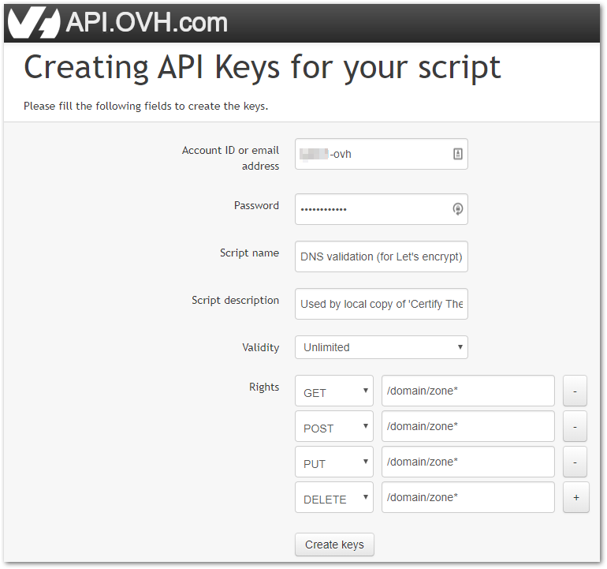
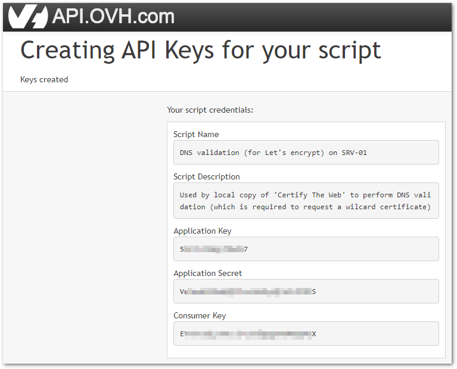
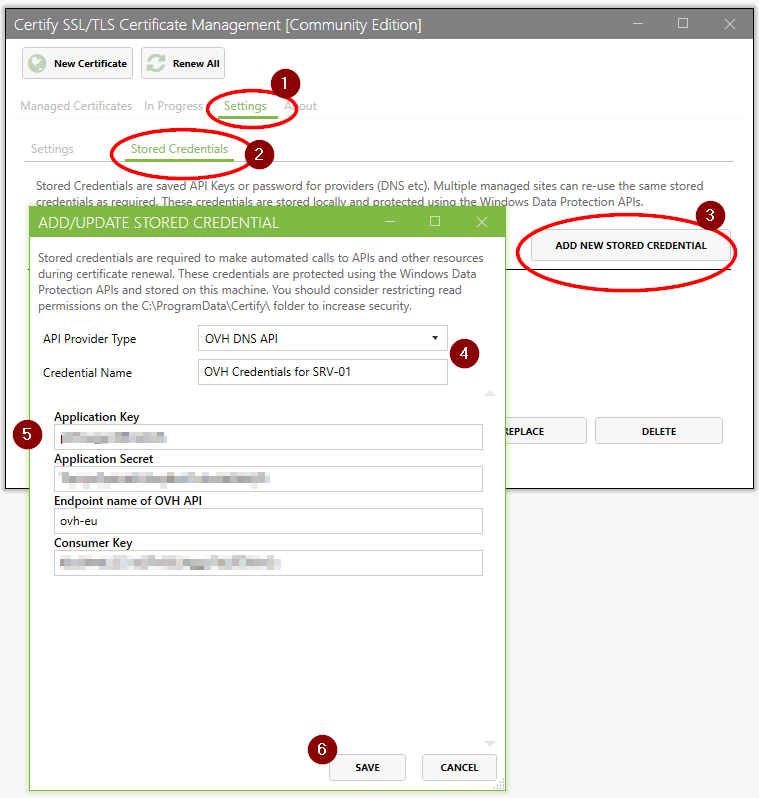

## Setup your DNS API credentials
To use the OVH DNS API, you need to create API keys on the OVH portal : 

- Go to the page [https://api.ovh.com/createToken/index.cgi?GET=/domain/zone*&PUT=/domain/zone*&POST=/domain/zone*&DELETE=/domain/zone*](https://api.ovh.com/createToken/index.cgi?GET=/domain/zone*&PUT=/domain/zone*&POST=/domain/zone*&DELETE=/domain/zone*)
- Fill the fields :
   - **Account Id / password** : your OVH credentials (used to access the OVH web portal)
   - **Script name** : as you want. Mine is "*DNS validation (for Let's encrypt) on SRV-01*" (because SRV-01 is the server where the credentials will be used)
   - **Script description** : as you want. Mine is "*Used by local copy of 'Certify The Web' to perform DNS validation (which is required to request a wilcard certificate).*"
   - **Validity** : set *Unlimited* if you don't want to renew the credentials periodically. (On a test environments, set a short delay for security reasons)
   - **Rights** : set `/domain/zone*` on `GET`, `POST`, `PUT`, `DELETE` to allow only access to the DNS API of OVH and no other service. Note : OVH API actions are listed [here](https://api.ovh.com/console/#/domain).
   
- Validate with the 'Create Keys' button
- Copy down the Application Key, Application Secret and Consumer Key.

## Add New Stored Credential to Certify

Now add a new Stored Credential in Certify, choosing OVH DNS as the provider type, and enter:

- Your API Application Key
- Your API Application Secret
- Your Consumer Secret
- The endpoint name of the OVH API. It must be one of the following : `ovh-eu`, `ovh-ca`, `kimsufi-eu`, `kimsufi-ca`, `soyoustart-eu`, `soyoustart-ca`, `runabove-ca`
- Click Save.

   

- **Test your credentials** by selecting the credentials in the list and clicking the "Test" button

