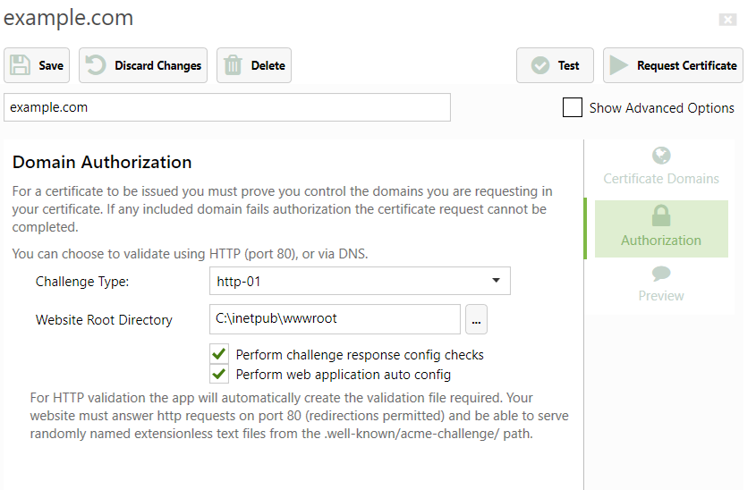
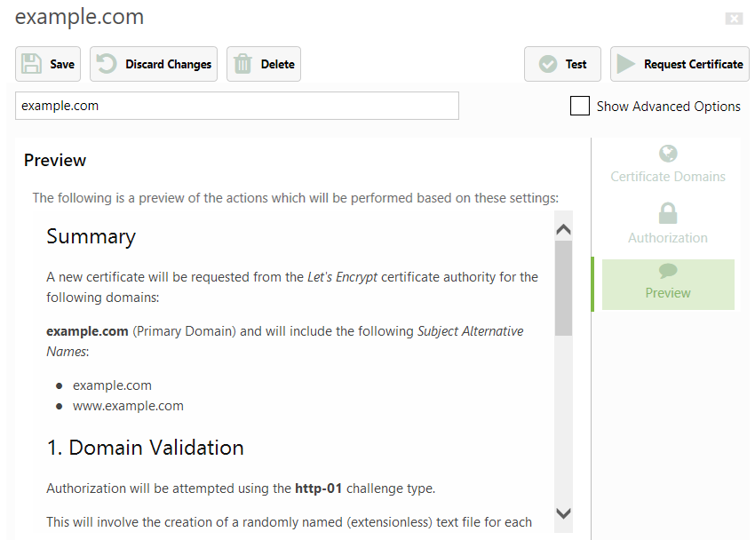

# Managed Certificates
The left side of the main window shows the list of Managed Certificates the app is currently looking after.

# Managed Certificate Details

## Status
If you have a current certificate managed by the app this view shows the date of the last renewal, when the certificate expires and any issues encountered during the most recent auto-renewal attempts. 

You can also open the Log file for this Managed Certificate to see any recently encountered issues.

## Certificate Domains
This view lets you manage the domains you will include in your certificate request:

You can optionally select an existing website hosted on this server, this will auto populate the list of domains to include in the certificate based on the existing hostname bindings of the website. This website will also become the preferred 'target' for the final deployed certificate.

If you don't choose an existing website or want to manually add domains, enter the domains and select 'Add Domains'. You can add domains individually or in a semicolon separated list.

To remove a domain from the list, select the domain and press the 'Delete' key.

### Wildcard Domains
You can also manually add *Wildcard Domains* to a certificate request. A wildcard domain takes the form `*.yourdomain.com` and the resulting certificate would cover the `yourdomain.com` and `anything.yourdomain.com`, but it will not cover nested subdomains i.e.`www.anything.yourdomain.com`

You cannot mix certificate requests for a Wildcard and a first-level subdomain (e.g. in a request for `*.yourdomain.com` and `www.yourdomain.com`, you should remove the `www.yourdomain.com` as it's already covered by the wildcard domain).

Wildcard domains require DNS validation, HTTP validation is not supported.

## Authorization (Validation)
This view lets you decide how you will prove current control of the domains being requested on your certificate. The options cover [HTTP Validation](http-validation.md) and [DNS Validation](dns-validation.md).

## Preview
This view describes which actions will be performed based on your current settings. This view is especially useful if you have complex deployment requirements or if you just want to understand exactly what will happen when the certificate is requested and applied.

## Advance Options
Checking 'Show Advanced Options' in the Managed Certificate view enables a range of further options:

## Deployment
By default, deployment is to a single IIS website, adding or updating https bindings as required to upgrade or maintain the website bindings as https.

Other options include:
- Deploy to all websites
- Matching certificate to bindings based on various criteria.
- Storage only (stored to Certificate store in the current machine)
- No Deployment - the certificate file is downloaded but no other deployment action is performed.

## Scripting
### Pre/Post Request Scripting
You can opt to perform [pre and post-request PowerShell scripting](script-hooks.md). This is especially useful for custom deployment tasks which need to be notified of the new certificate thumbprint, or for distributing your new certificate to other services in your organisation.

### Web Hooks
You can also choose to make requests (GET or POST) to custom http based web hooks.

# In Progress
The *In Progress* view shows any currenty running request/renewals.

# Settings
Commonly used settings you can specify include:

### Auto Renewal Interval (Days) 
This is how many days the app will wait after your certificate was last renewed, before attempting another renewal. This is generally a number well in advance of the default 90 days expiry, to allow time to account for any renewal issues that arise.

## Stored Credentials
Stored Credentials are protected API keys/passwords which are required in order to automate certificate renewal. This is generally used to managed API credentials for DNS API providers.

# About
 On the *About* tab you can:
 - See details on the current app version
 - Check for updates
 - Register - this will take you to the registration website where you can purchase the Professional and Enterprise versions of the app.
 - Enter Key - this allows you to enter a registration key and activate your licensed version of the app.